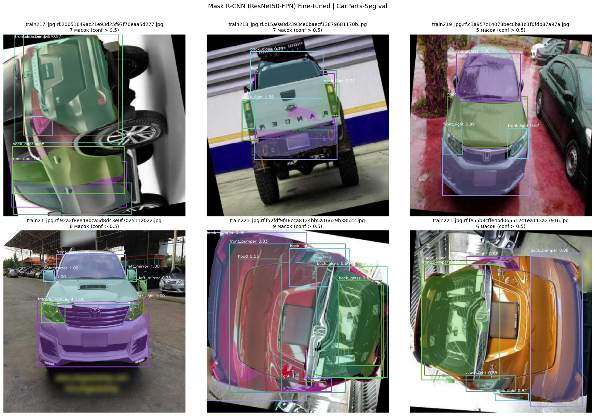
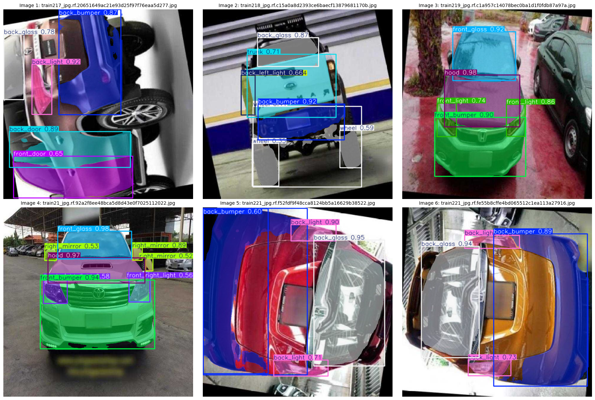
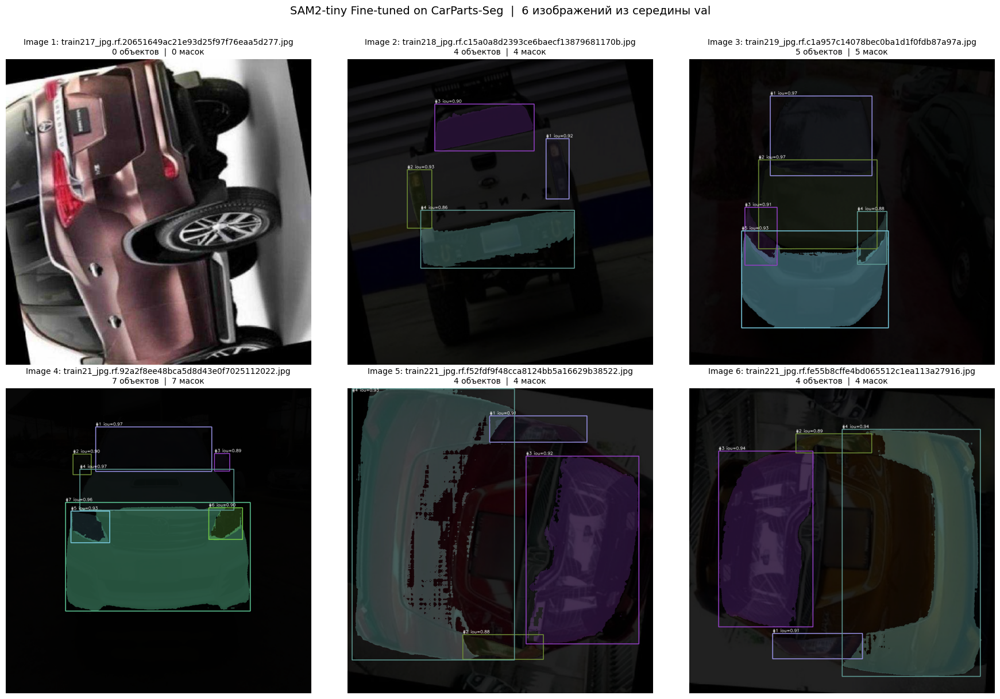
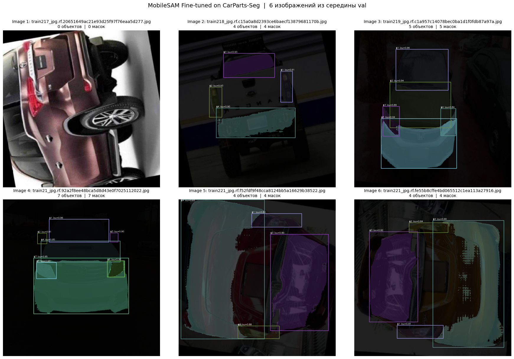
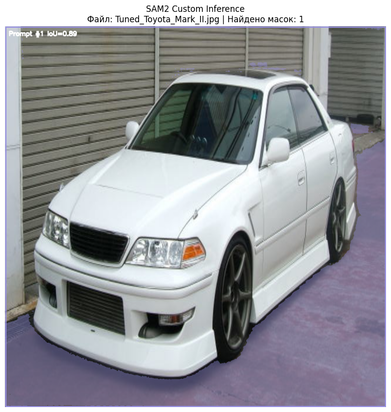
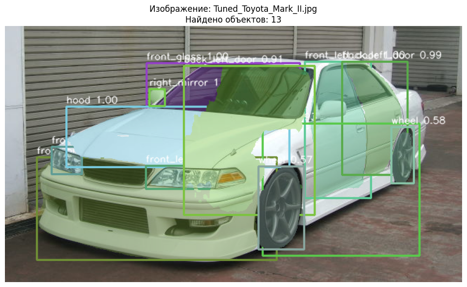

# Оценка применимости моделей сегментации реального времени для задач дополненной реальности в автомобильной кастомизации

> **Сравнение YOLO11n-seg · SAM2-tiny · MobileSAM · Mask R-CNN**

---

## Описание проекта

Данная работа является исследованием применимости современных моделей сегментации объектов для использования в AR-приложениях, предназначенных для визуализации кастомизации автомобилей (изменение цвета кузовных деталей, подбор аксессуаров, стайлинг).

Ключевая задача такого приложения — **точно и быстро сегментировать конкретные части кузова** (бампер, дверь, стекло, фары и т.д.) на изображении или видеопотоке, чтобы затем накладывать визуальные изменения в режиме реального времени.

Для достижения этой цели исследуются четыре архитектурно различные модели сегментации, каждая из которых дообучается на специализированном датасете кузовных деталей и оценивается по единому протоколу.

---

## Цели и задачи

### Цель
Выявить наиболее подходящую модель для сегментации в реальном времени для AR-приложения по кастомизации автомобилей по критериям **качества маски** и **производительности (FPS)**.

### Задачи
1. Дообучить четыре архитектурно различных модели сегментации на датасете кузовных деталей автомобиля: SAM2-tiny, MobileSAM, YOLO11n-seg, Mask R-CNN.
2. Оценить качество сегментации каждой модели по единому унифицированному протоколу (Mask Recall @ IoU Threshold).
3. Замерить производительность каждой модели (FPS) в условиях инференса на GPU.
4. Провести сравнительный анализ соотношения качество/скорость для выбора оптимальной архитектуры под AR-задачи.

---

## Датасет

| Параметр | Значение |
|---|---|
| **Название** | Car Parts Segmentation Dataset (CarParts-Seg) |
| **Автор** | Ultralytics |
| **Формат** | YOLO (полигоны, нормализованные координаты) |
| **Число классов** | 23 |
| **Train** | ~2 300 изображений |
| **Val** | 401 изображение |
| **Размер** | 640×640 (YOLO), 1024×1024 (SAM2, MobileSAM), переменный (Mask R-CNN) |

### Классы
`back_bumper`, `back_door`, `back_glass`, `back_left_door`, `back_left_light`,
`back_light`, `back_right_door`, `back_right_light`, `front_bumper`, `front_door`,
`front_glass`, `front_left_door`, `front_left_light`, `front_light`, `front_right_door`,
`front_right_light`, `hood`, `left_mirror`, `object`, `right_mirror`,
`tailgate`, `trunk`, `wheel`

---

## Модели

### 1. YOLO11n-seg
- **Backbone:** CSPDarkNet (nano)
- **Параметры:** ~2.8M
- **Разрешение входа:** 640×640
- **Особенность:** end-to-end детекция + сегментация; обучается «из коробки» через Ultralytics API

### 2. SAM2-tiny (Segment Anything Model 2)
- **Backbone:** Hiera-Tiny (image encoder)
- **Параметры:** ~38.9M (из них заморожено: image encoder + memory modules)
- **Разрешение входа:** 1024×1024
- **Особенность:** prompt-guided сегментация (GT bbox как промпт); class-agnostic

### 3. MobileSAM
- **Backbone:** TinyViT (5M) вместо ViT-H оригинального SAM
- **Параметры:** ~9.66M (из них заморожено: TinyViT image encoder)
- **Разрешение входа:** 1024×1024
- **Особенность:** облегчённая версия SAM с тем же prompt_encoder + mask_decoder

### 4. Mask R-CNN (ResNet50-FPN)
- **Backbone:** ResNet50 + FPN
- **Параметры:** ~44.4M (из них заморожено: backbone.body / ResNet50)
- **Разрешение входа:** 800–1333px (переменный, внутренний resize)
- **Особенность:** двухэтапная архитектура; end-to-end детекция + сегментация + классификация

---

## Гиперпараметры

### Общие (все модели)
| Параметр | Значение |
|---|---|
| Эпох | 10 |
| Оптимизатор | AdamW |
| Learning Rate | 1e-4 |
| Weight Decay | 0.01 |
| LR-шедулер | Linear warm-up (5% шагов) + Cosine Annealing |
| Стратегия заморозки | Только backbone / image encoder |
| Seed | 42 |

### Индивидуальные
| Параметр | YOLO11n-seg | SAM2-tiny | MobileSAM | Mask R-CNN |
|---|---|---|---|---|
| Batch size | 16 | 4 | 4 | 2 |
| Input size | 640 | 1024 | 1024 | 800–1333 |
| Loss | Ultralytics built-in | Dice + Focal + IoU-reg | Dice + Focal + IoU-reg | CE + Smooth L1 + BCE |
| Замороженные модули | — | image_encoder, memory_attention, memory_encoder | image_encoder (TinyViT) | backbone.body (ResNet50) |

---

## Протокол оценки

Используется **единый унифицированный протокол** для корректного сравнения всех четырёх архитектур:

### Mask Recall @ IoU Threshold
```
Для каждого GT-объекта:
    best_iou = max(Mask_IoU(pred_mask_k, gt_mask))

Метрика @ t = mean(best_iou >= t)   для t ∈ {0.50, 0.55, ..., 0.95}
mAP@0.50:0.95 = mean(Метрика @ t)
```

**Условия для каждой модели:**
- **SAM2 / MobileSAM** — получают GT bounding box как oracle-промпт → 1 маска на объект
- **YOLO / Mask R-CNN** — самостоятельная детекция; при пропуске объекта `best_iou = 0`

> Данный подход консервативен по отношению к end-to-end моделям (YOLO, Mask R-CNN), но позволяет сравнить **качество самой маски** в единых условиях.

### Дополнительные метрики
- `mAP@0.50` — доля объектов с mask IoU ≥ 0.50
- `mAP@0.75` — доля объектов с mask IoU ≥ 0.75
- `Mean Mask IoU` — средний IoU по всем GT-объектам
- **FPS** — кадров/сек при инференсе на GPU (100 итераций после 20 прогревочных)

---

## Структура проекта

```
AR-Segmentation-Auto-Evaluation/
│
|
├── requirements.txt # Зависимости
├── README.md # Описание проекта репозитория
│
|
├── Code/
|    └── SP2_SegModelsForAutoCustomization.ipynb # Основной Jupyter(Colab)-блокнот проекта
|
├── results/
|   └── mask R-CNN # Содержит веса конкретной модели
|    |    └── mask_rcnn_best.pt
|    ├── mobileSAM # Содержит веса конкретной модели
|    |    └── mobile_sam_carparts_best.pt
|    |
|    ├── sam2 # Содержит веса конкретной модели
|    |    └── sam2_tiny_carparts_best.pt
|    ├── yolon11-seg # Содержит веса конкретной модели
|    |    └── best.pt
|    |
|    └── imagesAndGraphs #Содержит результаты в виде изображений и графов
|
|
|
└── dataset/ # Папка с оригинальным датасетом
   └── carparts-seg/
       ├── carparts-seg.yaml
       ├── images/
       │   ├── train/
       │   └── val/
       └── labels/
           ├── train/
           └── val/

```

---

## Установка зависимостей

### 1. Клонирование репозитория
```bash
git clone <your-repo-url>
cd SP2_SegModelsForAutoCustomization
```

### 2. Создание виртуального окружения 
```bash
python -m venv venv
source venv/bin/activate        # Linux / macOS
# venv\Scripts\activate.bat     # Windows
```

### 3. Установка основных зависимостей
```bash
pip install -r requirements.txt
```

> **Примечание:** torch устанавливается с поддержкой CUDA 11.8. Для другой версии CUDA
> замените `cu118` на нужную: `cu121`, `cu124` и т.д.

### 4. Установка SAM2 (Facebook Research)
```bash
git clone https://github.com/facebookresearch/sam2.git
cd sam2
pip install -e .
pip install supervision pycocotools
cd ..
```

### 5. Установка MobileSAM
```bash
pip install git+https://github.com/ChaoningZhang/MobileSAM.git
```

### 6. Загрузка предобуенных весов для последующего дообучения на датасете проекта

**SAM2-tiny:**
```bash
mkdir -p sam2/checkpoints
wget -P sam2/checkpoints/ \
  https://dl.fbaipublicfiles.com/segment_anything_2/092824/sam2.1_hiera_tiny.pt
```

**MobileSAM (TinyViT):**
```bash
wget -O mobile_sam.pt \
  https://github.com/ChaoningZhang/MobileSAM/raw/master/weights/mobile_sam.pt
```

---

## Запуск экспериментов

> Все эксперименты выполняются в блокноте **Google Colab** (GPU: Tesla T4 / A100).
> Для локального запуска адаптируйте пути `/content/...` под свою файловую систему.

### Шаг 0 — Фиксация seed (первая ячейка)
```python
# Запустить ячейку "Фиксация seed-ов" перед любым другим кодом
seed = 42
```

### Шаг 1 — Загрузка датасета
```python
from ultralytics import YOLO
import os

os.makedirs('/content/datasets/carparts-seg', exist_ok=True)
# Датасет скачивается через Ultralytics CLI:
!yolo cfg=ultralytics/cfg/datasets/carparts-seg.yaml
# или вручную через wget / Google Drive
```

### Шаг 2 — Дообучение YOLO11n-seg
```python
from ultralytics import YOLO
model = YOLO("yolo11n-seg.pt")
results = model.train(
    data="/content/datasets/carparts-seg.yaml",
    epochs=10,
    imgsz=640,
    batch=16,
    device=0,
    project="yolo_carparts",
    name="yolo11n_seg_finetune",
)
```

### Шаг 3 — Дообучение SAM2-tiny
```bash
# Сборка модели
cd /content/sam2
```
```python
import torch
from sam2.build_sam import build_sam2

model = build_sam2(
    config_file="configs/sam2.1/sam2.1_hiera_t.yaml",
    ckpt_path="/content/sam2/checkpoints/sam2.1_hiera_tiny.pt",
    device="cuda",
)
# Далее запустить ячейки: заморозка → датасет → цикл обучения
# Чекпойнты сохраняются в: /content/sam2_carparts_checkpoints/
```

### Шаг 4 — Дообучение MobileSAM
```python
from mobile_sam import sam_model_registry

ms_model = sam_model_registry["vit_t"](checkpoint="/content/mobile_sam.pt")
ms_model = ms_model.to("cuda")
# Далее запустить ячейки: заморозка → датасет → цикл обучения
# Чекпойнты сохраняются в: /content/mobile_sam_carparts_checkpoints/
```

### Шаг 5 — Дообучение Mask R-CNN
```python
from torchvision.models.detection import (
    maskrcnn_resnet50_fpn,
    MaskRCNN_ResNet50_FPN_Weights,
)
mr_model = maskrcnn_resnet50_fpn(
    weights=MaskRCNN_ResNet50_FPN_Weights.DEFAULT,
    min_size=800,
    max_size=1333,
)
# Далее запустить ячейки: замена голов → заморозка backbone → цикл обучения
# Чекпойнты сохраняются в: /content/mask_rcnn_carparts_checkpoints/
```

### Шаг 6 — Оценка по единому протоколу
```python
# Запустить раздел "Итоговая оценка трёх моделей по единому протоколу оценивания"
# Функции: parse_gt_masks_unified(), unified_eval()
# Результат: mAP@0.50, mAP@0.75, mAP@0.50:0.95, Mean Mask IoU для всех 4 моделей
```

### Шаг 7 — Замер FPS
```python
# Каждая модель имеет отдельную ячейку "Замер производительности"
# Методология: 20 прогревочных итераций → 100 замерных, torch.cuda.synchronize()
# Детализация: время encoder отдельно от decoder/head
```

---

## Воспроизводимость

Для полной воспроизводимости экспериментов:

1. Первой запущенной ячейкой блокнота должна быть ячейка фиксации seed.
2. При создании DataLoader передавать `worker_init_fn=seed_worker, generator=g` (определены в seed-ячейке).
3. Использовать `torch.backends.cudnn.deterministic = True` и `benchmark = False`.

> **Примечание:** полная детерминированность на GPU не гарантируется при использовании
> некоторых CUDA-операций. Результаты могут незначительно
> отличаться между запусками при одинаковом seed.

---

## Результаты

### Качество сегментации (Unified Protocol — Mask Recall @ IoU)

--------
| Модель | mAP@0.50 | mAP@0.75 | mAP@0.50:0.95 | Mean IoU | Протокол |
|---|---|---|---|---|---|
| YOLO11n-seg | 0.988 | 0.898 | 0.8 | 0.872 | Full pipeline |
| SAM2-tiny FT | 0.996 | 0.941 | 0.847 | 0.897 | Oracle GT-box prompt |
| MobileSAM FT | 0.995 | 0.925 | 0.816 | 0.883 | Oracle GT-box prompt |
| Mask R-CNN FT | 0.96 | 0.863 | 0.754 | 0.839 | Full pipeline |
 
--------

### Производительность (FPS на Tesla T4)
--------
| Модель | Размер модели (МБ) | FPS | Параметры |
|---|---|---|---|
| YOLO11n-seg | ~5.7 | 69 | 2.8M |
| SAM2-tiny FT | ~184 | 7.4 | 38.9M |
| MobileSAM FT | ~72 | 18 | 9.66M |
| Mask R-CNN FT | ~333 | 11.2 | 44.4M |
--------
### Визуальные результаты работы моделей (качество сегментации и масок)
#### Mask R-CNN

#### YOLO (yolov11n-seg)

#### SAM2 (sam2-tiny)

#### MobileSAM

--------

### SAM 2 (без детектора) vs Mask R-CNN
--------



---

## Зависимости

| Библиотека | Версия | Назначение |
|---|---|---|
| torch | 2.1.0+cu118 | Deep learning framework |
| torchvision | 0.16.0+cu118 | Mask R-CNN, transforms |
| ultralytics | ≥8.0.0 | YOLO11n-seg |
| sam2 | git | SAM2-tiny |
| mobile-sam | git | MobileSAM (TinyViT) |
| transformers | ≥4.40.0 | Zero-shot SAM2 (HuggingFace) |
| opencv-python-headless | ≥4.8.0 | Обработка изображений |
| pycocotools | ≥2.0.7 | COCO-метрики |
| supervision | ≥0.18.0 | Визуализация масок |

Полный список — в файле [`requirements.txt`](requirements.txt).

---

## Аппаратное обеспечение

Эксперименты проводились в среде **Google Colab**:
- **GPU:** NVIDIA Tesla T4 (15 GB VRAM)
- **RAM:** 16 GB
- **CUDA:** 12.8
- **Python:** 3.12.13
- **PyTorch:** 2.11.0+cu128
